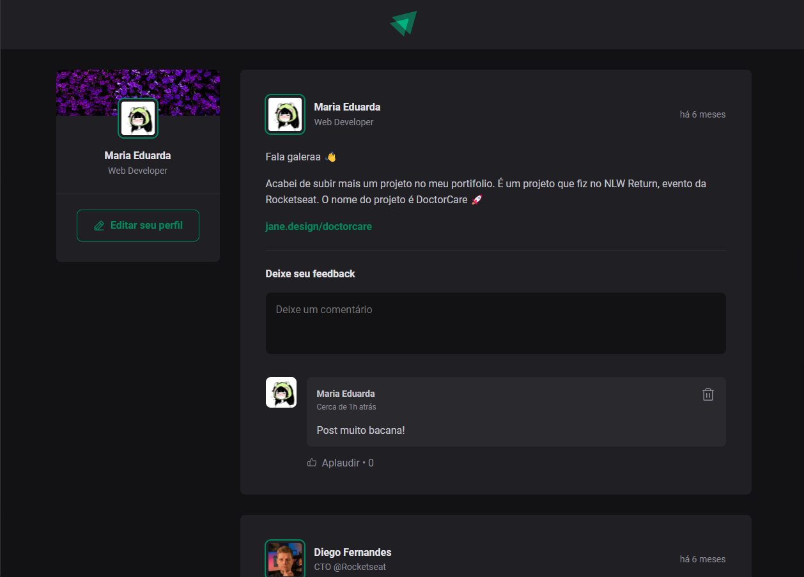

<h1 align="center" style="text-align: center;">
  
  Ignite Feed
</h1>

<p align="center">
  <a href="#project">Descrição</a>&nbsp;&nbsp;&nbsp;|&nbsp;&nbsp;&nbsp;
  <a href="#technologies">Tecnologias</a>&nbsp;&nbsp;&nbsp;|&nbsp;&nbsp;&nbsp;
  <a href="#installation">Instalação</a>&nbsp;&nbsp;&nbsp;|&nbsp;&nbsp;&nbsp;
  <a href="#license">Licença</a>
</p>

<h2 id="project">📄 Descrição</h2>

O projeto é um sistema de feed que permite aos usuários criar, visualizar e interagir com posts. Os usuários têm a capacidade de adicionar, remover e aplaudir comentários.

<p align="center">
   
</p>

<h2 id="technologies">💻 Tecnologias</h2>

Este projeto foi desenvolvido com as seguintes tecnologias:

- HTML e CSS
- React
- TypeScript
- JSON
- Vite

<h2 id="installation">🚀 Instalação</h2>

Certifique-se de ter o `Node.js` e o `npm` instalados antes de prosseguir:

```bash
# clone o projeto
$ git clone https://github.com/mjepis7/ignite-feed

# acesse a pasta do projeto
$ cd ignite-feed

# instale as dependências
$ npm install

# inicie o servidor
$ npm run dev
```

<h2 id="license">📝 Licença</h2>

Este projeto está sob a licença MIT.
# ignite-feed
